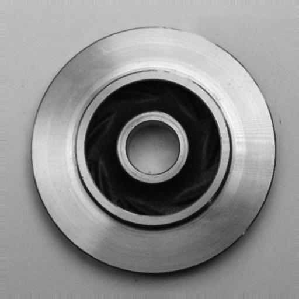
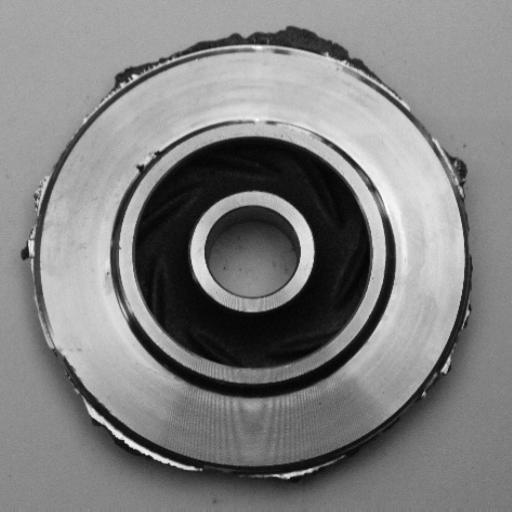

# CVAE-GAN Industrial Defect Generator

This repository hosts the demonstration and research code for industrial defect synthesis with a CVAE-GAN architecture. It is focused on generating realistic casting defects for data augmentation in industrial **Computer Vision** workflows.

## Overview

The synthesis of stochastic casting defects, such as porosity, remains a difficult problem in industrial inspection. This project uses a **Conditional Variational Autoencoder (CVAE)** together with a **Generative Adversarial Network (GAN)** to model the distribution of metallic textures and generate realistic defect variations.

By disentangling the latent space, the model can generate both defect-free and defective samples from the same underlying geometry, making it useful for inspection datasets and defect simulation.

## Gallery

The examples below come from `demo/assets` and show the clean/defective pair used by the demo.

| Clean part | Defective part |
| --- | --- |
|  |  |

Sample captions used for the reference pair:

- Clean part: `photo of a top-down industrial casting inspection, circular machined component, flat grey ferrous material, flawless smooth surface, QC passed, neutral factory lighting, plain background`
- Defective part: `photo of a top-down industrial casting inspection, circular machined component, flat grey ferrous material, severe porosity defect, surface blowholes and cavities, QC failed manufacturing reject, neutral factory lighting, plain background`

## Key Features

- Controlled synthesis of casting defects through latent vector manipulation.
- Structural consistency that preserves the geometry and lighting of the metallic piece.
- Dual output generation for healthy and defective counterparts.
- Research-oriented design focused on the data scarcity problem in industrial quality control.

## Technical Foundation

The architecture is built around three components:

- A **CVAE encoder** that compresses images into a latent representation.
- A **conditional decoder/generator** that reconstructs or synthesizes parts from the latent vector and class label.
- An optional **discriminator** that supports adversarial training and improves realism.

The decoder uses latent arithmetic to inject a defect direction vector, allowing the model to move from a clean piece toward a defective one while preserving the underlying casting geometry.

## Project Structure

```text
.
├── demo/
│   ├── app.py
│   ├── model.py
│   ├── assets/
│   └── checkpoints/
├── research/
│   ├── data/
│   │   ├── raw/
│   │   └── processed/
│   └── notebooks/
│       └── train.ipynb
├── environment.yml
├── requirements.txt
├── .gitattributes
├── .gitignore
├── LICENSE
└── README.md
```

## Data Layout

The project expects industrial casting data prepared for training and inference under the research folder.

```text
research/
├── data/
│   ├── raw/
│   │   └── casting/
│   │       └── casting_512x512/
│   │           ├── ok_front/
│   │           └── def_front/
│   └── processed/
│       └── casting/
│           └── casting_512x512/
│               ├── ok_front/
│               │   ├── images/
│               │   └── canny/
│               └── def_front/
│                   ├── images/
│                   └── canny/
└── notebooks/
```

Model checkpoints and defect vectors used by the demo are stored in `demo/checkpoints/`.

## Training Workflow

1. Prepare the casting dataset for training.
2. Train the CVAE-GAN model in the research notebook.
3. Export the learned weights and defect direction vector.
4. Place the generated artifacts inside `demo/checkpoints/`.
5. Launch the Gradio demo from `demo/app.py`.

## Demo

The Gradio interface in `demo/app.py` loads the CVAE defined in `demo/model.py` and produces a healthy reference image together with a defective variant controlled by alpha interpolation.

To run the demo locally:

```bash
python demo/app.py
```

## Installation

Create the Conda environment from `environment.yml` or install the lightweight dependencies from `requirements.txt`.

```bash
conda env create -f environment.yml
conda activate cvae_gan_defect
```

or

```bash
pip install -r requirements.txt
```

## Hardware & Performance

The model is designed to run efficiently on standard hardware, while still producing high-fidelity synthetic defects for industrial inspection tasks. GPU acceleration is recommended for faster inference and training.

## References

The implementation follows standard ideas from variational inference, adversarial learning, and conditional generation, including CVAE, GAN, and residual learning techniques.

## License

See [LICENSE](LICENSE) for the project license.
